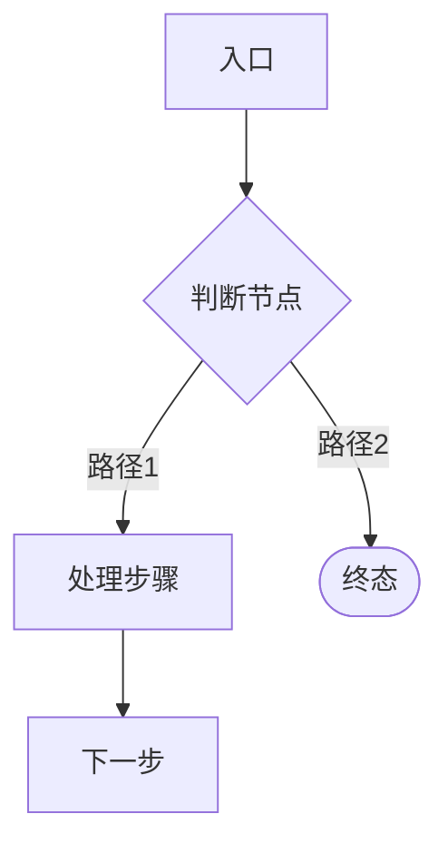
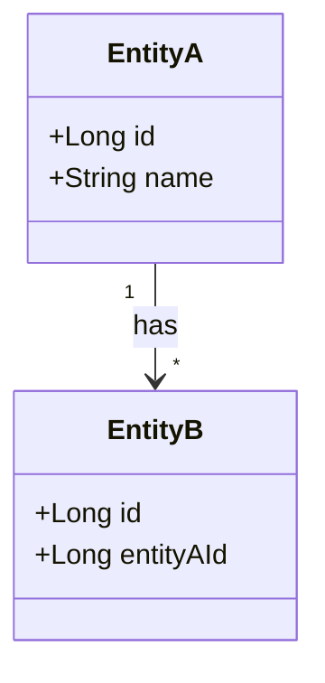

# CodeMap 模板

> **定位**：codemap 是 Research 层产出，记录**已有代码**的结构与调用链，是 arch-agent 阅读代码后的"导航索引"。
> 它不是设计方案（设计在 `02_technical_design.md`），不是源码拷贝，也不是功能文档。
>
> **触发条件**：复杂场景必须产出（改动涉及 2+ package / 外部集成 / 调用链 > 3 层 / 状态机 / 异步流程）

---

## 目录结构

```
.claude/codemap/
  domains/           ← 唯一存储位置，按业务域命名，持续维护
    domain-<业务域A>.md
    domain-<业务域B>.md
    ...
```

### Architect 工作规则

1. 收到新 Feature 时，先查 `domains/` 是否有对应业务域文件
2. **有** → 读现有文件 → 增量 Research（聚焦本次改动范围）→ **更新** 第 7 节"影响分析"填入本次具体改动点
3. **无** → 完整 Research → 新建 `domains/domain-<业务域>.md`，第 7 节填本次改动点
4. Feature 完成后（QA PASS，由主会话提示）→ arch-agent 更新第 4/5/6 节反映新代码现状，**清空**第 7 节恢复为占位状态

---

```markdown
# CodeMap: <功能名称>

## 元信息

| 项 | 值 |
|----|----|
| 生成时间 | YYYY-MM-DD hh:mm |
| 生成者 | arch-agent |
| 关联 Spec | `.claude/specs/YYYY-MM-DD_hh-mm_<name>/01_requirement.md` |
| 涉及项目 | （列出涉及的子项目，如后端/前端各 App） |

---

## 1. 功能边界

### 本 CodeMap 覆盖

- （列出本次调研涉及的功能模块，每条一句）

### 本 CodeMap 不展开

- 真实生产环境配置与凭证
- 与本次功能无关的历史兼容逻辑
- （其他不覆盖项）

---

## 2. 入口总览

### 后端入口（如适用）

| 入口类型 | 路径 / 类名:方法名 | 说明 |
|---------|-----------------|------|
| REST API | `XxxController#yyy` → `POST /api/xxx` | 简要说明 |
| WebSocket | `XxxWsHandler#onMessage` | 简要说明 |
| 定时任务 | `XxxTask#execute` | 简要说明 |

### 前端入口（全栈场景适用）

| 入口类型 | 路由路径 / 文件路径 | 说明 |
|---------|----------------|------|
| 页面路由 | `/agent-center/xxx` → `pages/xxx/index.vue` | 简要说明 |
| Store Action | `store/xxx.js#fetchXxx` | 简要说明 |

---

## 3. 主流程图

> 使用 flowchart TD，描述**现有**主链路（不是新设计），≤ 15 个节点



---

## 4. 后端模块分层（如适用）

### Controller 层

| 类名 | 文件路径 | 关键方法 | 说明 |
|------|---------|---------|------|
| `XxxController` | `controller/XxxController.java:行号` | `createXxx`, `listXxx` | 简要说明 |

### Service 层

| 类名 | 文件路径 | 关键方法 | 说明 |
|------|---------|---------|------|
| `XxxService` | `service/XxxService.java:行号` | `doSomething` | 简要说明 |

### Mapper / XML 层

| Mapper | XML | 关键 SQL ID | 说明 |
|--------|-----|------------|------|
| `XxxMapper` | `mapper/XxxMapper.xml` | `selectByCondition` | 简要说明 |

### 外部集成点（如适用）

| 集成目标 | 调用方式 | 入口类:方法 | 关键参数 |
|---------|---------|-----------|---------|
| Dify | HTTP Stream | `DifyService#sendMsg` | conversationId, inputs |
| OpenClaw | WebSocket | `OpenClawWsClient#send` | taskId, command |

---

## 5. 前端模块分层（全栈场景适用）

### 页面层

| 页面 | 文件路径 | 关联 Store | 说明 |
|------|---------|----------|------|
| XXX 列表 | `pages/xxx/index.vue` | `store/xxx.js` | 简要说明 |

### Store 层

| Module | 文件路径 | 关键 State | 关键 Action | 说明 |
|--------|---------|----------|-----------|------|
| `xxx` | `store/xxx.js` | `list`, `total` | `fetchList`, `create` | 简要说明 |

### 组件层（仅关键组件）

| 组件 | 文件路径 | 被哪些页面使用 | 说明 |
|------|---------|-------------|------|
| `XxxForm` | `components/XxxForm.vue` | `pages/xxx/index.vue` | 简要说明 |

---

## 6. 关键数据结构

### 数据库表（现有）

| 表名 | 关键字段 | 索引 | 说明 |
|------|---------|------|------|
| `ai_agents` | `id`, `platform_id`, `status` | `idx_platform_id` | 简要说明 |

### 实体关系图（表间关联复杂时补充）



---

## 7. 影响分析

> 新功能将对以下现有代码产生改动，Dev/FE 必须重点关注

### 后端影响

| 模块 / 文件 | 影响类型 | 说明 |
|------------|---------|------|
| `XxxController.java` | 新增方法 | 新增 `POST /api/xxx` 端点 |
| `XxxService.java` | 修改逻辑 | 在 `doSomething()` 中插入新校验 |
| `ai_xxx` 表 | 新增字段 | 新增 `config_json` 列（JSON 类型） |
| `XxxMapper.xml` | 新增 SQL | 新增 `selectByNewCondition` |

### 前端影响（全栈场景适用）

| 模块 / 文件 | 影响类型 | 说明 |
|------------|---------|------|
| `store/xxx.js` | 修改 Action | `fetchList` 增加新查询参数 |
| `pages/xxx/index.vue` | 修改页面 | 新增筛选项 + 表格列 |
| `components/XxxForm.vue` | 修改组件 | 新增表单字段 |

---

## 8. 风险热点

1. **（风险 1 标题）**：说明踩坑原因与边界。
2. **（风险 2 标题）**：说明历史遗留约束或兼容性注意事项。
3. **（风险 3 标题）**：说明并发/事务/缓存一致性等潜在问题。

---

## 9. Dev / FE 建议切入点

**后端建议从这里读起**：
1. `XxxController#yyy`（文件路径:行号）— 了解入口
2. `XxxService#doSomething`（文件路径:行号）— 了解核心逻辑

**前端建议从这里读起**（全栈场景）：
1. `pages/xxx/index.vue`（文件路径:行号）— 了解页面结构
2. `store/xxx.js#fetchList`（文件路径:行号）— 了解数据流
```

---

## 使用说明

- **字段可裁剪**：简单功能可省略"前端模块分层"或"实体关系图"等节，但第 1、3、7、8、9 节不可省略
- **不拷贝源码**：表格中只填类名/方法名/行号作为索引，不粘贴代码内容
- **保持精简**：总长度建议控制在 200 行以内，超出则说明 Research 范围太宽，需拆分
- **时效性**：每次 Feature QA PASS 后，主会话提示 arch-agent 更新 `domains/` 对应文件，保持与最新代码对齐（第 7 节清空占位，第 4/5/6 节更新）

<!-- codeflow-framework:core v1.7.1-20260420 — DO NOT EDIT ABOVE THIS LINE, managed by upgrade.sh -->
