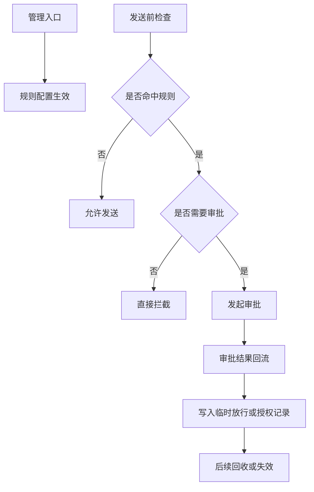

# 协作内容审核 CodeMap（公开示例）

- 生成时间：2026-02-25 20:10
- 模式：`create_codemap(feature)`
- 范围：协作内容审核（规则管理 + 内容检查 + 审批回流 + 临时放行）
- 目标：展示如何用 CodeMap 组织复杂功能的入口、主链路、状态边界与风险点

---

## 1. 功能边界

本地图覆盖：
- 规则管理入口
- 内容发送前检查链路
- 审批发起与审批结果回流
- 临时放行与后续回收
- 配置、灰度与后处理

本地图不展开：
- 真实仓库路径
- 具体类名与方法名
- 组织结构、租户规则和历史兼容细节
- 生产环境监控、报警与数据表设计

---

## 2. 入口总览

### 2.1 管理入口
- 规则列表查询
- 规则创建 / 修改 / 删除
- 生效范围配置
- 审批模板关联

### 2.2 内容检查入口
- 内容发送前统一检查链路
- 内容命中后返回“允许 / 拦截 / 需审批”的判定结果

### 2.3 审批事件入口
- 审批发起
- 审批结果回流
- 审批通过后的临时放行或授权记录

---

## 3. 主流程概览

---

## 4. 核心模块分层

### 4.1 规则层
- 规则读取与查询
- 规则生效范围判断
- 规则更新后的缓存失效

### 4.2 检查层
- 输入内容类型识别
- 发送场景识别
- 按规则命中结果生成处理决策

### 4.3 审批层
- 审批参数装配
- 审批发起
- 审批结果解析
- 审批通过后的状态写回

### 4.4 临时放行层
- 记录短时放行
- 控制放行时效
- 避免永久放大授权范围

### 4.5 后处理层
- 到期回收
- 状态清理
- 失败重试

---

## 5. 关键状态与边界

- 规则命中结果至少应区分：`allow` / `block` / `needs_approval`
- 审批通过后的放行必须与“永久白名单”语义严格区分
- 临时放行必须带有效期，避免无限扩大权限
- 灰度逻辑与默认逻辑必须边界清晰，避免多版本叠加后行为漂移

---

## 6. 风险热点

1. 多版本逻辑并存时，灰度命中顺序容易导致行为不一致。
2. 审批通过与临时放行的语义混淆，容易把短时授权误做成永久授权。
3. 缓存失效与规则更新不同步，容易出现“后台已改、前台仍旧”的现象。
4. 后处理回收不完整时，可能造成授权残留。
5. 若调试时只看单点日志，容易忽略“发送检查 → 审批 → 回流 → 回收”的闭环。

---

## 7. 推荐排查顺序

1. 先确认规则是否正确命中
2. 再确认命中后是否真的进入审批或拦截分支
3. 再确认审批结果是否准确回流
4. 最后确认临时放行与回收是否闭环

---

## 8. 适合在公开示例中保留的信息

- 功能边界
- 分层结构
- 主流程图
- 风险分类
- 排查方法

## 9. 不适合在公开示例中保留的信息

- 真实仓库路径
- 真实类名 / 方法名 / 表名 / Key 名
- 具体灰度常量
- 生产事故编号、日志样本、内部链路标识
- 可直接映射到真实系统的快速定位索引
