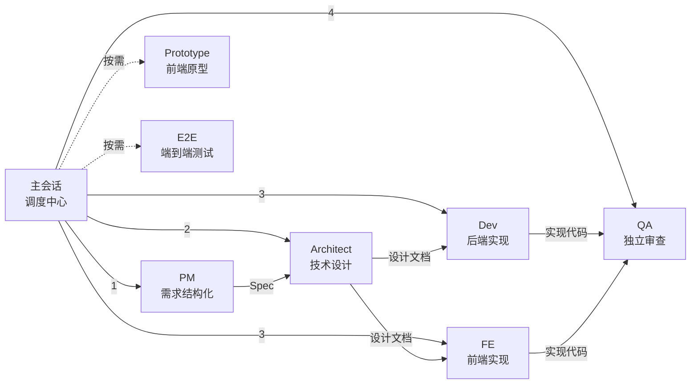
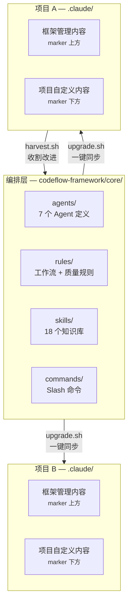

# 一、框架概述

## 1.1 定位

codeflow-framework 是一个**元框架项目**（不是应用项目），为多个业务项目提供统一的 **Spec-Driven Development (SDD)** 工作流规范、Agent 定义、质量检查规则和知识库。多个下游业务项目通过 `upgrade.sh` 从本仓库同步框架文件，确保所有接入项目遵循一致的协作标准。

**命名：`codeflow-framework`**

理由：
1. **含义清晰**：Code Flow = 编码工作流，覆盖从需求→设计→开发→测试→部署全链路
2. **易记易写**：简洁规范，适合跨团队推广
3. **扩展性强**：未来可扩展衍生版本（如 codeflow-lite 等）

## 1.2 核心理念

**三铁律**：

| 铁律 | 含义 | 约束 |
|------|------|------|
| **No Spec, No Code** | 未形成清晰 Spec 前，禁止进入代码实现 | 所有功能变更必须先产出需求/设计文档 |
| **Spec is Truth** | Spec 是需求和实现的唯一真相源 | 发现 Spec 与代码不一致时，先修 Spec 再改代码 |
| **No Approval, No Execute** | 未得到明确批准，禁止执行高风险操作 | 每个阶段产出物需用户确认后才进入下一阶段 |

**七角色**：

**四工作流**：

- **Q0 轻量模式**：单文件 / bug fix / 配置变更，走轻量协议
- **工作流 A**：纯后端 — API / 数据库 / 后端逻辑变更
- **工作流 B**：纯前端 — 页面 / 组件 / 交互开发
- **工作流 C**：前后端联动 — 新增业务实体等全栈变更

## 1.3 两层分离架构

## 1.4 三种文件类型

| 类型 | 管理方式 | 示例 |
|------|---------|------|
| **被管理文件** | 由 `upgrade.sh` 自动更新（含 stub marker），marker 上方为框架内容 | `agents/*.md`、`rules/project_rule.md` |
| **模板文件** | 初始化时从模板复制到项目，之后由项目独立维护 | `CLAUDE.md`、`coding_backend.md` |
| **子项目脚手架** | 初始化时按类型（前端/后端）自动生成，之后由项目独立维护 | 子项目 `.claude/context/`、`.claude/rules/` |
| **项目自定义** | 项目团队完全自主创建和维护，框架不干预 | `specs/`、`codemap/`、`project-memory/` |
