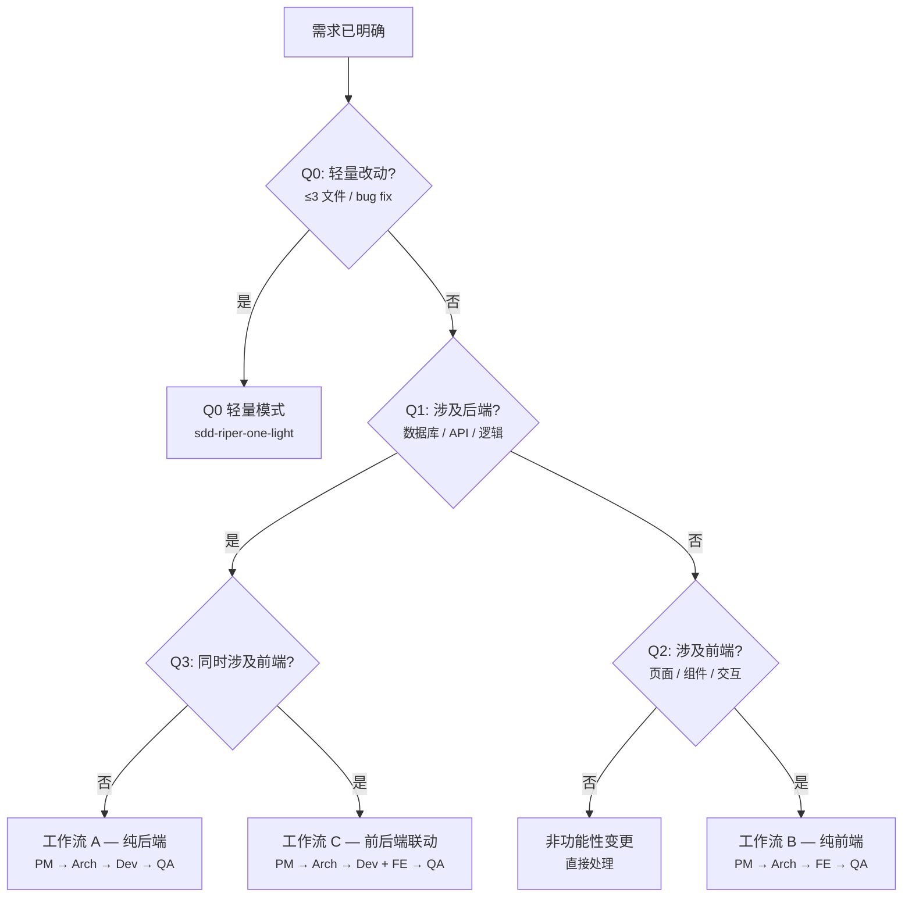

# 四、工作流体系

## 4.1 Intake 触发机制

任何涉及"新增/修改/删除功能"的需求，主对话**第一步必须执行 Intake 三问**：

```
1. 目标   — 要做什么？数据来源？涉及哪个项目？
2. 边界   — 不做什么？是否需要鉴权？是否涉及已有接口？
3. 验收   — 做完怎么算完成？
```

三问回答清晰后，进入智能路由。

**Jira Issue 检测（可选）**：Intake 阶段主会话会检测用户输入中的 Jira Issue Key。如检测到，自动获取 Issue 详情作为上下文。需要项目配置 Jira MCP Server（`.mcp.json`），未配置则静默跳过，不影响流程。

**需求确认门控**：Intake 完成后，主对话必须向用户呈现需求摘要 + 路由判断 + 询问确认。**只有用户明确回复"开始"/"确认"/"继续"后**，才可路由并启动 PM Agent。

## 4.2 智能路由决策树



## 4.3 四种工作流详解

### Q0 轻量模式

适用：单文件改动、小 bug 修复、配置变更、小特性增强。

使用 **sdd-riper-one-light** 协议，4 层深度自适应：

| 深度 | 适用场景 | 流程 |
|------|---------|------|
| 零 Spec | 纯机械改动（改名、格式化） | 直接执行 + summary |
| 快速 | 明确的小改动 | 1-3 句 spec → 批准 → 执行 |
| 标准 | 默认模式 | 复述理解 → 轻量 spec → checkpoint → 批准 → 执行 → 回写 |
| 深度 | 需求模糊 / 涉及架构 | 显式分析 → 详细 spec → 批准 → 执行 → 回写 |

### 工作流 A：纯后端

```
主对话 Intake → 路由判定
    ↓
@pm-agent（后端模式）
    → 产出：01_requirement.md
    → 用户 Approval
    ↓
@arch-agent（后端模式）
    → 调研现有代码 + MCP 数据库查询 + 知识对齐（如存在 knowledge-index.md，设计对齐已有 cookbook 模式）
    → 产出：02_technical_design.md（Part A: API Contract / Part D: DB Schema / Part E: 测试场景 / Part C: 风险）
    → 用户 Approval
    ↓
@dev-agent
    → 建 feature 分支
    → Research: 知识按需加载（如存在 knowledge-index.md，匹配任务加载 cookbook/pattern）
    → Execute（DB 操作 + 编码 + 自测 + 产出 04 测试计划）
    → 证据写入 evidences/ → 呼叫 QA
    ↓
@qa-agent（后端 Review）
    → 四轴验收 + 04 测试审计 + 构建验证
    → PASS / FAIL
    ↓
@e2e-runner（可选，需用户选择且项目已配置 E2E）
    → 先 Deploy → 再基于 02 Part E 执行 Playwright E2E
    ↓
主会话
    → 后端 API 自动验证（读取 04 Part B，curl 核心接口）
    → 用户确认 → 合并 + 推送
```

### 工作流 B：纯前端

```
主对话 Intake → 路由判定
    ↓
@pm-agent（前端模式）→ 用户 Approval
    ↓
@prototype-agent（需用户指示）
    → 建 prototype 分支 → Vue 原型 → 用户预览 → 迭代至确认
    ↓
@arch-agent（前端模式）
    → 调研现有代码 + 知识对齐（如存在 knowledge-index.md，设计对齐已有 cookbook 模式）
    → 产出：02_technical_design.md（Part B: 前端设计 / Part E: 测试场景 / Part C: 风险）
    → 用户 Approval
    ↓
@fe-agent
    → 建 feature 分支（有原型时先 merge）→ Research: 知识按需加载（如存在 knowledge-index.md）
    → 编码 + lint + 构建验证 + 产出 04 → 呼叫 QA
    ↓
@qa-agent（前端 Review）
    → 四轴验收 + 04 测试审计 + lint 验证
    → PASS / FAIL
    ↓
@e2e-runner（可选，同上）
    ↓
主会话
    → 前端手工验证（用户按 04 Part B 验证清单操作浏览器）
    → 合并 + 推送 → 删除 prototype 分支
```

### 工作流 C：前后端联动

```
主对话 Intake → 路由判定
    ↓
@pm-agent（全栈模式）→ 用户 Approval
    ↓
@prototype-agent（需用户指示，同工作流 B）
    ↓
@arch-agent（全栈模式）
    → 同时调研前后端 + MCP 查 DB + 知识对齐（如存在 knowledge-index.md）
    → 产出：02_technical_design.md（Part A + B + D + E + C）
    → 用户 Approval
    ↓
@dev-agent ⚡ @fe-agent（worktree 隔离并行）
    → Dev worktree: feature/<name>-backend
    → FE worktree: feature/<name>-frontend（有原型时先 merge）
    → 各自产出 04 后通知主对话
    ↓
主会话 → merge backend → merge frontend → 清理 worktrees
    ↓
@qa-agent（全栈 Review）
    → 五轴（比 A/B 多一轴：API 契约一致性）+ 04 测试审计
    → PASS / FAIL
    ↓
@e2e-runner（可选，同上）
    ↓
主会话
    → 后端 API 自动验证 + 前端浏览器验证
    → 用户确认 → 合并 + 推送
```

### Spec 产出物定义

| 文件 | 产出者 | 定位 | 审批门控 |
|------|--------|------|---------|
| `01_requirement.md` | PM | 需求规格（业务语言，含字段级页面结构） | **用户必须审批** |
| `02_technical_design.md` | Arch | 技术设计（API + 前端 + DB + 测试场景 + 风险） | **用户必须审批** |
| `03_impl_backend.md` | Dev | 后端执行日志（修改文件 + 关键决策 + 问题记录） | 无需审批，供 QA 参考 |
| `03_impl_frontend.md` | FE | 前端执行日志（修改文件 + 关键决策 + 问题记录） | 无需审批，供 QA 参考 |
| `04_test_plan.md` | Dev/FE | 测试计划（追溯矩阵 + 全流程用例），QA 审计 | 无需审批 |

> `02_interface.md` 已废弃，其内容（API Contract、前端数据映射）合入 `02_technical_design.md`。

## 4.4 合并前检查清单

合并任何 `feature/*`、`fix/*`、`refactor/*` 分支前，必须通过以下检查：

**通用检查（8 项）**：
1. Spec 同步：对应 Spec 文档已更新
2. 最小改动：遵循 YAGNI/KISS
3. 独立验收：QA 已 PASS
4. 构建验证：编译/lint 无错
5. 后端 API 验证：curl 测试（A/C 工作流）
6. 前端运行验证：浏览器验证（B/C 工作流）
7. 联调确认：前后端同时运行状态验证（C 工作流）
8. 冲突检测：无同名文件冲突

**后端专项（5 项）**：异常处理、入参校验、代码清理、SQL 规范、数据库变更脚本

**前端专项（3 项）**：`<style scoped>` 强制、微前端隔离、交互与数据完整性

**全栈专项（1 项）**：API 契约一致性（设计文档 vs 后端实现 vs 前端调用）

## 4.5 E2E 测试触发规则（可选）

QA PASS 后、运行验证前，主会话**必须询问用户**是否执行 E2E 测试。

**触发条件**（全部满足才可触发）：
1. QA 审查结论为 PASS
2. 用户明确选择执行 E2E
3. 项目已配置 E2E 测试基础设施（`e2e/` 目录存在或有 Playwright 配置）

**前置条件**：先 Deploy 部署到测试环境，获取 E2E_BASE_URL 和测试账号。

**跳过场景**：项目无 `e2e/` 目录、轻量流程（Q0 路由）。

## 4.6 运行验证（Verification）

QA PASS 后、合并前，主会话必须组织运行验证：

| 验证类型 | 适用工作流 | 方式 | 证据 |
|---------|-----------|------|------|
| 后端 API | A / C | 读取 04 Part B → 启动服务 → curl 验证 → 回写状态 | `evidences/evidence-api-test.md` |
| 前端页面 | B / C | 用户按 04 Part B 人工验证清单操作浏览器 | 用户反馈 |
| 全栈联调 | C | 后端自动验证 + 前端人工验证 | 同上 |

## 4.7 Deploy 阶段（可选）

Deploy 是**可选、非阻塞**的。主会话只负责触发构建脚本并推送镜像，服务器部署由 Watchtower 异步完成。

**触发时机**：

| 场景 | 触发时间 | 说明 |
|------|---------|------|
| E2E 测试 | QA PASS 后、E2E 前 | 需先部署再测试 |
| 生产部署 | 合并后 | 代码已合并到 develop |

## 4.8 Jira 集成（可选）

Jira 集成是**可选的、非阻塞的**——未配置时所有 Jira 操作被静默跳过。

| 阶段 | Jira 操作 | 执行者 |
|------|----------|--------|
| Intake | 读取 Issue 详情（描述、AC、状态） | 主会话 |
| Spec | 将 Issue Key 写入 01 头部 | PM Agent |
| 实现 | Issue → "In Progress"；完成时添加评论 | Dev/FE Agent |
| 审查 | PASS/FAIL 评论回 Jira | QA Agent |
| 收尾 | Issue → "Done/Closed" | 主会话 |

配置要求：项目根目录 `.mcp.json` 包含 Jira MCP Server 连接信息。详见 `templates/mcp-config.json.template`。
